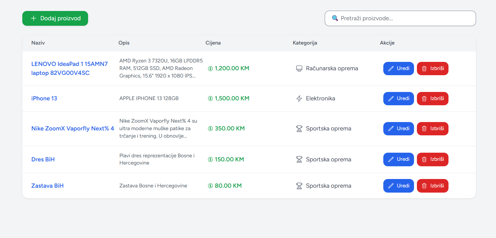
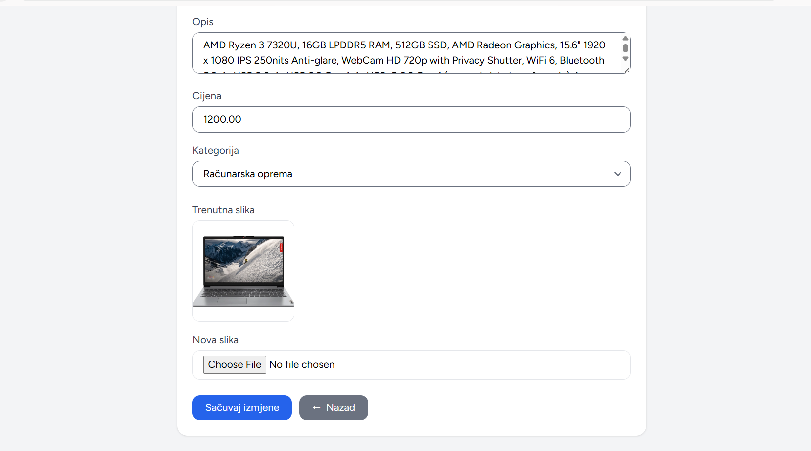
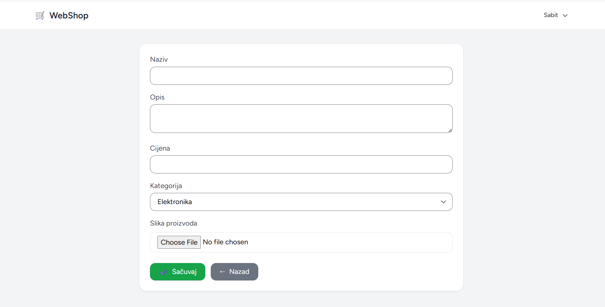
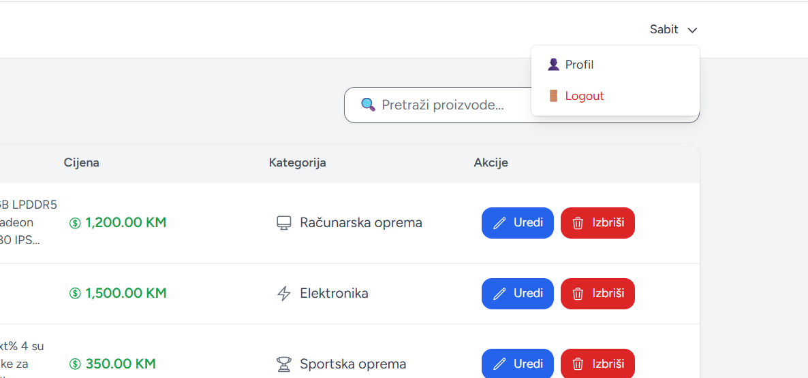
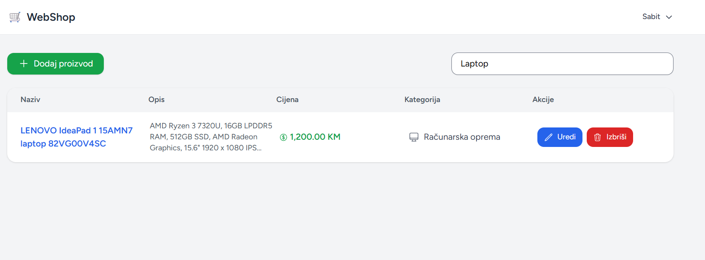

# Shop Laravel CRUD Project

## 📌 Opis projekta
Ovo je jednostavna web aplikacija razvijena u Laravel frameworku koja omogućava upravljanje proizvodima kroz CRUD operacije (kreiranje, pregled, izmjena i brisanje).

Aplikacija koristi MySQL bazu podataka i implementira autentifikaciju korisnika.

---

## ⚙️ Tehnologije
- Laravel (PHP framework)
- MySQL baza podataka
- HTML, CSS
- Bootstrap

---

## 🔐 Funkcionalnosti
- Registracija i login korisnika
- Dodavanje novih proizvoda
- Prikaz svih proizvoda (tabelarni prikaz)
- Izmjena postojećih proizvoda
- Brisanje proizvoda
- Kategorije proizvoda
- Upload slika proizvoda

---
## 🖼️ Izgled aplikacije

### 1. Lista proizvoda

### 2. Prikaz opisa proizvoda

### 3. Edit / izmjena proizvoda

### 4. Dodavanje proizvoda

### 5. Login / korisnički meni (profil, logout)

### 6. Pretraga (search funkcionalnost)

---

## 🗄️ Baza podataka
U projektu se nalazi SQL dump fajl:

database/shop.sql

koji sadrži strukturu baze i testne podatke.

---

## 🚀 Pokretanje projekta

1. Kloniraj repozitorij:

git clone https://github.com/wiza4t/shop.git

2. Uđi u projekat:

cd shop

3. Instaliraj dependencije:

composer install

4. Kreiraj .env fajl i podesi bazu

5. Importuj bazu:

database/shop.sql

6. Pokreni server:

php artisan serve

---

## 👨‍💻 Autor
Laravel CRUD studentski projekat